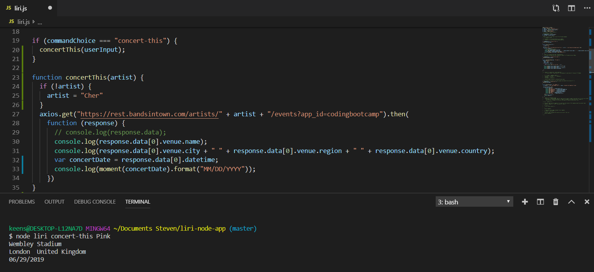

## LIRI

Liri takes phrase typed by the user (via command line) and returns data about the subject they provide. The app uses the following APIs to provide this information.

   * Node-Spotify-API
   * Bands in Town Artist Events API
   * OMDB API

Liri uses axios to pull from the APIs and Moment.js to parse dates into a readable format. The app was written using techniques demonstrated in our exercise files along with the knowledge provided by our outstanding UNC instructors.

## INSTRUCTIONS

Navigate to the liri.js file and type the following commands in terminal or GitBash.

   * `node liri concert-this (artist name)` - returns concert information about an artist.
   * `node liri spotify-this-song (song name)` - returns song and album information about a song.
   * `node liri movie-this (movie name)` - returns information about a movie.
   * `node liri do-what-it-says` - calls one of liri's commands from a text file.
   
## SCREENSHOTS

## GITHUB
https://keensteven.github.io/liri-node-app/
https://github.com/keensteven/liri-node-app.git
